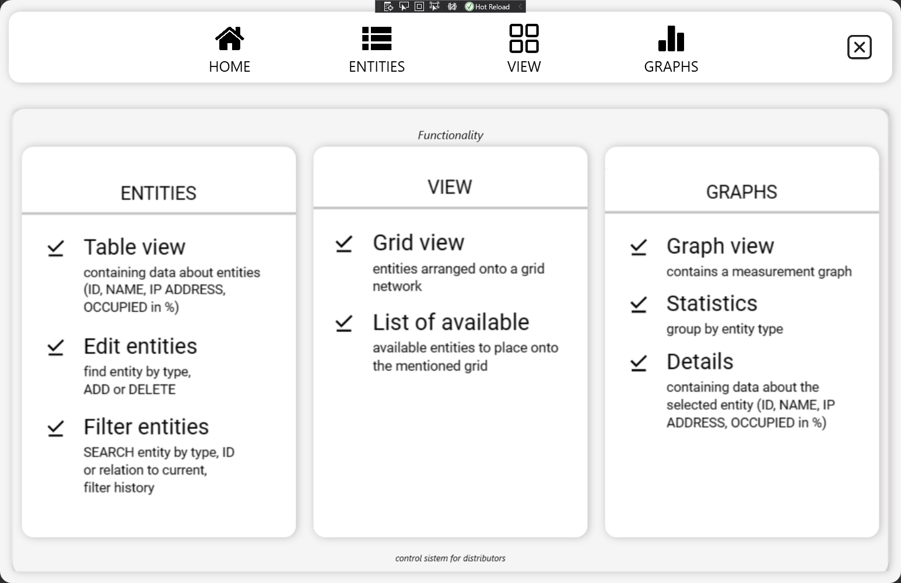
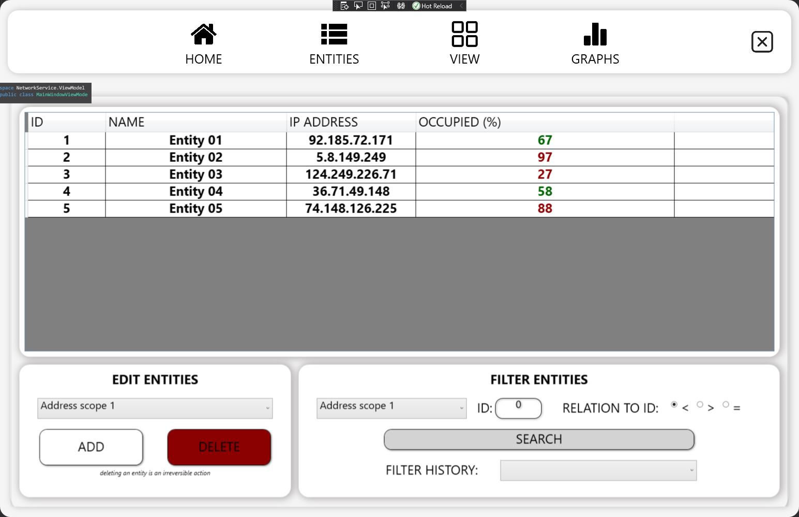
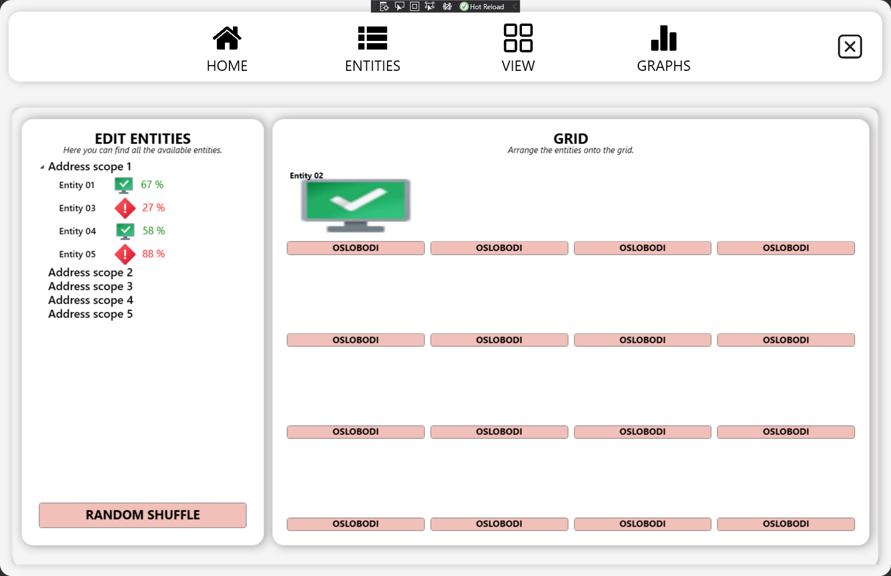
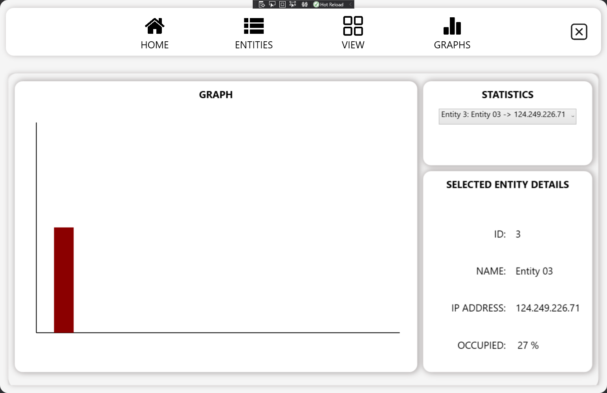

 <h2 align="center">NetworkService</h2>
 
Simulator infrastrukturnog sistema

 
<b>WPF MVVM aplikacija</b> koja predstavlja servis (NetworkService) za monitoring izmerenih 
                   vrednosti nad entitetima u sistemu. Merenja se dobijaju od već implementirane aplikacije 
                   MeteringSimulator.

                   
 
<b>NetworkService</b> omogućava svom korisniku tabelarni prikaz entiteta u sistemu, njihov raspored na 
                   <i>Drag&Drop</i> mreži, kao i prikaz podataka pomoću grafikona. <b>MeteringSimulator</b> će u nasumičnim 
                   vremenskim trenucima slati podatke ka <b>NetworkService</b> aplikaciji uz indikaciju za koji entitet se 
                   prosleđuje dati podatak.
                

 

# Dostupne opcije

-   Uvid u tabelu zabeleženih merenja
-   Dodavanje nove potrošnje
-   Uklanjanje potrošnje
-   Pretraga po filteru
-   Grafički prikaz merenja
-   Pregled statistike
-   Raspored u mreži

 

# Interfejs

Home page Window

 

Table view Window

 

Grid view Window

 

Graph view Window

 

> **Note**
> Projekat je rađen na predmetu <b>Inženjerstvo upotrebljivosti u infrastrukturnim sistemima</b>
